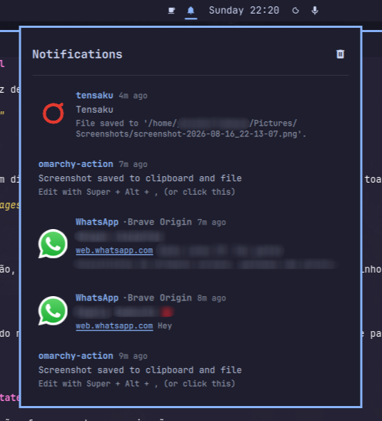

# Herald Notification Center for Omarchy

A clean notification center for the Omarchy shell. Click the bell icon to browse recent notifications and active toasts, focus the source app, or dismiss items individually.



## Features

- **Unified list** of active popups and recent history in one panel
- **Themed icons** for web notifications (WhatsApp, Telegram, Gmail, and more)
- **Source-aware titles** like `WhatsApp · Brave Origin`
- **Click to focus** the originating window or app
- **Right-click to dismiss** a single notification
- **Clear all** with the header button or right-click the bar icon
- Follows the active Omarchy theme colors

## Easter Eggs

The Herald has a few surprises hidden up its sleeve:

- **Click the panel title:** Open the notification panel and repeatedly click the **"Notifications"** header. The Herald will cycle through alternative titles for the royal dispatch.
- **The Threshold Mystery:** Let your notifications pile up and watch how the Herald reacts. Some things are best discovered by using it.

*Found something else? It might be a feature, or it might be the Herald playing tricks.*

This project is a work in progress — I'd be happy to receive suggestions for improvements.

## Install

```sh
omarchy plugin add https://github.com/jesseburlamaque/herald-notification.git --enable
```

Then restart the shell:

```sh
omarchy restart shell
```

By default the bell icon is placed in the **center** section of the bar. If it does not land immediately to the left of the date/clock, drag it there with the bar's built-in gesture, or run:

```sh
omarchy bar move jesseburlamaque.herald-notification --section center --index 2
```

(Adjust the index as needed depending on your other center widgets.)

## Enable / Disable

You can manage the plugin through the Omarchy menu:

```sh
omarchy > menu >  Enable Plugin > Herald Notification
omarchy > menu >  Disable Plugin > Herald Notification
```

Or use the CLI:

```sh
omarchy plugin enable jesseburlamaque.herald-notification
omarchy plugin disable jesseburlamaque.herald-notification
```

After enabling or disabling, restart the shell:

```sh
omarchy restart shell
```

## Remove

```sh
omarchy plugin remove jesseburlamaque.herald-notification
```

Then restart the shell:

```sh
omarchy restart shell
```

## Usage

- **Left-click** the bell icon to open the notification center
- **Right-click** the bell icon to clear all notifications
- **Left-click** a notification to focus the source app or window
- **Right-click** a notification to dismiss it
- Use the header button to clear all visible notifications

## License

MIT
